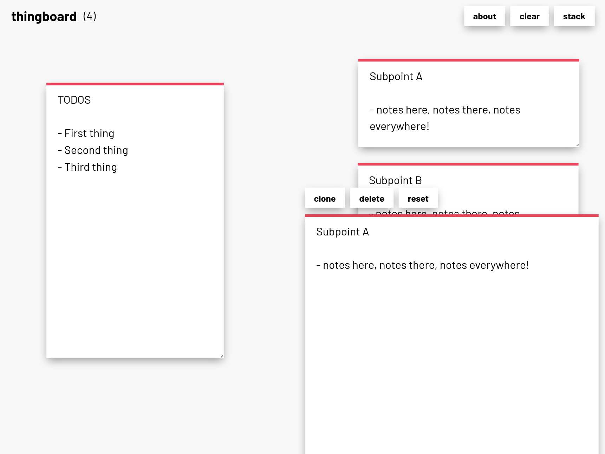

# thingboard 🖼️

**Thingboard** is just a simple **board** for writing **things** down. Frequently when I'm working, I find myself looking for places to jot stuff down to help me think and organize, but I don't want to be shuffling pieces of paper around, and it's nice to be able to copy-paste notes from other tools I use. Thingboard fulfills this need for me by being a board for Post-it style notes I can move and resize. It saves data to your browser's local storage.

You can try thingboard deployed on [Repl.it](https://thingboard.thesephist.repl.co) or [Vercel](https://thingboard.thesephist.vercel.app/).

Thingboard is a fully static, client-side rendered app built on a small pair of libraries:

- [Torus](https://github.com/thesephist/torus) for UI rendering
- [paper.css](https://thesephist.github.io/paper.css/) for easy aesthetics that match with the rest of my productivity tools.

